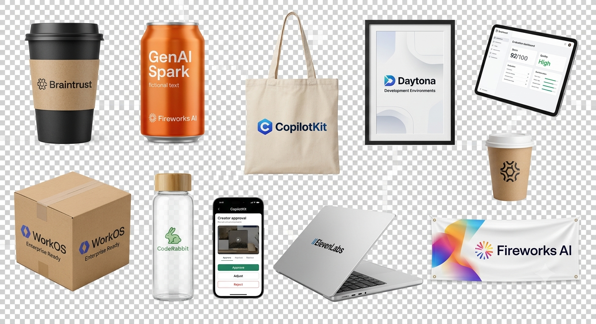

# Fork notes

This is [@SuchayK](https://github.com/SuchayK)'s fork of
[toyeshhm/ScreenSponsor](https://github.com/toyeshhm/ScreenSponsor). SceneSponsor was built by a
team at **Daytona HackSprint #5 with Braintrust** in San Francisco on **July 24, 2026**.

The upstream repo is the canonical one. This fork exists so I can point at the project from my
own profile and document what I worked on, since the whole team committed through one account
during the hackathon and the commit history doesn't separate us.

## What I worked on

I worked across the stack over the course of the build:

- **Scene understanding** — the placement-planning pipeline in `src/lib/fireworks.ts`: sampling
  frames out of the clip, prompting the vision model with each labelled frame, and constraining
  it to return per-keyframe placement quads with lighting, occlusion risk, and safety fields
  instead of inventing a fallback box.
- **Rendering** — the video path: keyframe interpolation, the FFmpeg composite, and the isolated
  worker that produces the 720×1280 H.264/AAC artifact.
- **Creator studio** — the review surface where the creator sees the agent's reasoning, adjusts
  geometry, and approves or rejects before anything can be exported.
- **Job API and data** — the `/api/jobs` routes, job state handling, and the Supabase schema.
- **Sponsor asset library** — every branded product asset in the demo. See below.

## The sponsor asset library

The compositor needs a product image with a transparent background before it can place anything
into a scene, so I generated the full asset library: **15 branded products across 8 sponsors** —
cans, bottles, tote bags, posters, banners, coffee cups, and a shipping box.

  

Product text is deliberately fictional ("GenAI Spark", and the cans are labelled `fictional text`)
so the demo doesn't put words in a real sponsor's mouth.

### Why the masters are in this fork

The assets that shipped in `public/campaign-assets/` are **JPEGs**, and JPEG has no alpha channel —
the transparent backgrounds were flattened in conversion. The originals in
[`assets/product-masters/`](assets/product-masters/) are the **RGBA PNGs** as I exported them, with
transparency intact. They're the correct source to composite from.

| | `public/campaign-assets/` | `assets/product-masters/` |
|---|---|---|
| Format | JPEG | PNG |
| Alpha channel | none | 8-bit RGBA |
| Use | what shipped in the demo | the masters to composite from |

`_library-sheet-1.png` and `_library-sheet-2.png` are the generated contact sheets the individual
assets were cut out of.

## Credit

Upstream authors: [@toyeshhm](https://github.com/toyeshhm) and
[@nsarkar7](https://github.com/nsarkar7). All application code in this repo is the team's shared
work — this file only records which parts I contributed to, and the assets under
`assets/product-masters/` are my own.
